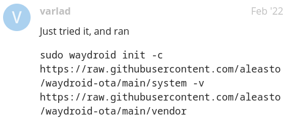

**WARNING:** This blog post comes with no warranty. It should be made clear that I do not know any of what I am doing.

I recently found out that [Waydroid](https://waydro.id), a container-based system to run android apps on Linux, got added to the Fedora repos. I have occasionally tried installing Waydroid with very little success, but this official support from my distro gave me new hope. So I decided to try it out again.

First of all, I installed the package with `sudo dnf install waydroid`. I decided to use the [Arch Wiki page](https://wiki.archlinux.org/title/Waydroid) for advice. It gave the following commands:


Out of those two, you probably want the ones with GApps support. A lot of Android apps require google services. When I ran that command, I got the following output:

```
[19:01:27] ERROR: Failed to get system OTA channel: /lineage/waydroid_x86_64/GAPPS.json, error: -1
[19:01:27] See also: <https://github.com/waydroid>
Run 'waydroid log' for details.
```

It can't find an image? Hmm. Well time to start looking for clues. The [first three search results](https://duckduckgo.com/?t=ffab&q=Failed+to+get+system+OTA+channel%3A+%2Flineage%2Fwaydroid_x86_64%2FVANILLA.json%2C+error%3A+-1&ia=web) didn't look directly related to my issue, so I moved on from that pretty quick. If there is something you should know about me, it's that I am lazy.

So here are the clues that actually got me to the solution.

## Fedora Copr
Fedora Copr is basically like Arch's AUR but with awful search. Before Waydroid was in the normal repos, this is where you would install Waydroid. It is also where I tried and failed to install it. I noticed this paragraph:


system, OTA, waydroid, that's enough words in common to think that this could be relevant!

## GitHub
One of the repositories in the Waydroid organization is named [OTA](https://github.com/waydroid/OTA). There's that word again! (acronym? intialism? whatever)

Anyways I saw a path that was interesting in here: `system/lineage/waydroid_x86_64/GAPPS.json`. That looks like what the program was looking for!

I also noticed the file `CNAME`. From experience with my own website, this is telling a github pages project to use a custom domain name. And what do we see in here? `ota.waydro.id`

## Solving the issue
I think it's safe to say that the error message, that note in the COPR repo, and the github repository are all referring to the same thing. But how do I put this information together?

Well, in the comments of that Fedora COPR page, I saw this:



Both of those links ([1](https://raw.githubusercontent.com/aleasto/waydroid-ota/main/system) and [2](https://raw.githubusercontent.com/aleasto/waydroid-ota/main/vendor)) are dead now, but that still gives me useful information. I can use the `-c` and `-v` flags to give a custom URL to find the files at.

Putting this all together, I came up with the following command:

```sh
# Nicely formatted for your reading pleasure
sudo waydroid init \
  -s GAPPS \
  -f \
  -c https://ota.waydro.id/system \ 
  -v https://ota.waydro.id/vendor
```

After entering my password, it started downloading the image. Once it was done, I continued following the arch wiki, and enabled the `waydroid-container` service with `systemctl enable --now waydroid-container.service` And everything just worked. Except for:

## This device isn't Play Protect certified
While testing if it worked, I was getting a notification every 5 seconds or so saying this. From what I can tell (and that is very little) Google has a program where they certify devices to be secure or not, and since this is a container, it hasn't been secured. As far as I could tell, this didn't stop anything from working, and you could disable this notification. If this actually means something important please let me know.